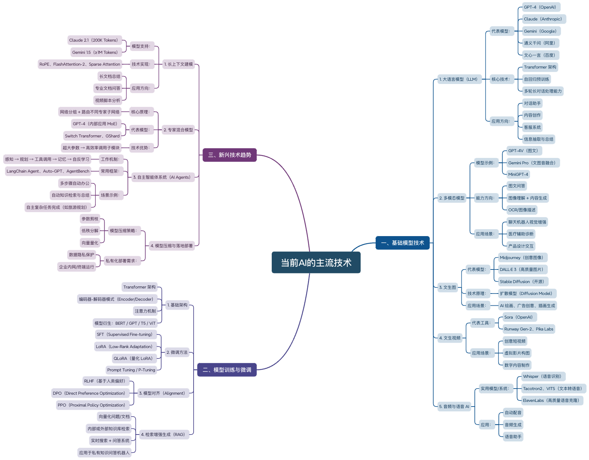

<!--
 * @Author: DengYH
 * @Date: 2025-05-08 19:53:53
-->
# 2025-05-08  Day1

## 工作记录
1、部署配置并学习使用CherryStudio、Cursor
2、学习使用工具Deepwiki
3、本地搭建GitHub项目[Agentic Company Researcher](https://github.com/pogjester/company-research-agent/tree/main)
4、了解当前AI的主流技术，绘制了xmind思维导图

## 其他
1、加入了微信和飞书的工作群
2、了解公司的框架和项目架构
3、办理招商银行的银行卡
4、领导补贴购买了MacminiM4

## 明日任务
1、学习FastAPI
2、研究Agentic Company Researcher项目架构
3、公司需求，联系同学帮忙购买两台MacminiM4

## 记录
- 项目虽然搭建好了，但是感觉很多概念还是很朦胧，遇到的报错没有办法独立解决也是因为对项目了解不够清晰，明天要研究清楚Agentic Company Researcher的整体架构。若有时间需要再补充一些知识点，比如：Agents、MCP、GEMINI等，周末可以再尝试一下使用Docker方法安装Agentic Company Researcher。